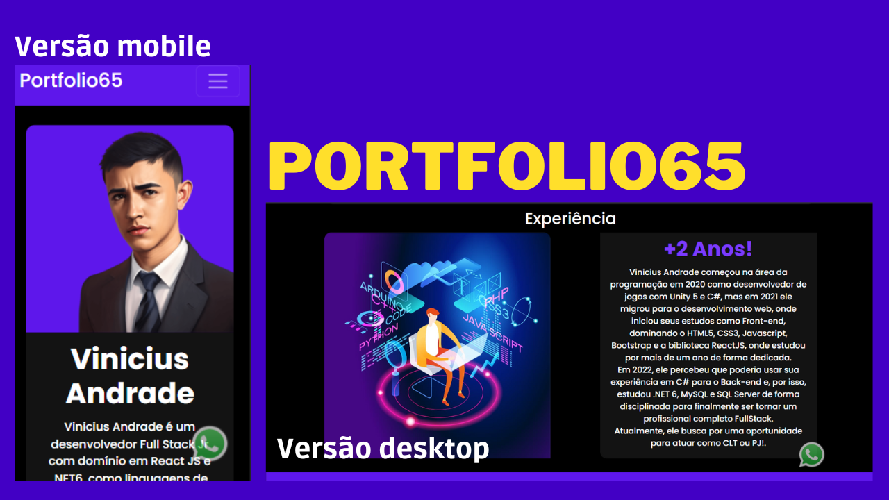

## Portfolio65

Ainda em construção! criado por mim para servir como meu portfólio!

<h5>Front-end criado com React JS e Bootstrap5 + ReactBoostrap já responsivo para diversos tamanhos de telas</h5>

  <h3>Primeira versão: a poucos dias estou desenvolvendo esse projeto nas horas vagas, ainda não está completo!.</h3>
  
- Portfólio funcional.

  
- Criação e organização em componentes

  

  <h3>Front-end:</h3>
  
 
    
    
  

<ol>
<ol>Rodar Front-end:</ol>
  <li>0 - Crie a (tela-de-comandos/prompt) na pasta "atividade-front-react" do front-end</li>
  <li>1 - Instale as dependencias: npm install</li>
  <li>2 - Rode projeto: npm start</li>
</ol>

